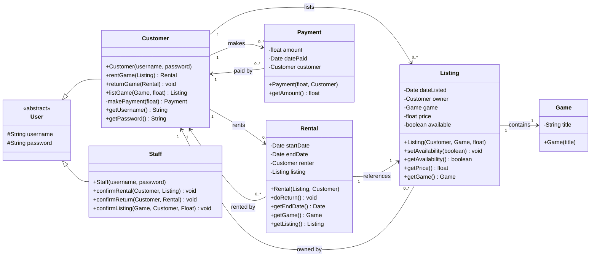

# Game Rental System

A Java tutorial project that models a game rental service. Users (customers and staff) manage game listings, rentals, and payments through a simple domain model.

## Project Setup

- **Language:** Java (source/target compatibility 1.5, runtime via GraalVM/OpenJDK)
- **Build tool:** Maven (`pom.xml`)
- **Entry point:** `Main.java` — prints a welcome message
- **Source layout:** Standard Maven structure (`src/main/java` for application code, `src/test/java` for tests)
- **Dependencies:** JUnit 4.12, Hamcrest Core 1.3, json-simple 1.1.1

## Running the Application

Helper scripts are provided to compile, run, and manage dependencies for both Linux/macOS (`.sh`) and Windows (`.bat`):

| Linux / macOS | Windows | What it does |
|---|---|---|
| `./install_deps.sh` | `install_deps.bat` | Downloads & copies project dependencies to `target/dependency` |
| `./compile.sh` | `compile.bat` | Compiles all source and test Java files |
| `./run.sh` | `run.bat` | Compiles, then runs the app (`Main`) |
| `./test.sh` | `test.bat` | Compiles, then runs the test suite (`TestRunner`) |

To run the app:

```bash
./run.sh
```

Equivalent manual commands:

```bash
javac -classpath ".:target/classes:target/dependency/*" -d target/classes $(find src -name "*.java")
java -classpath "target/classes:target/dependency/*" Main
```

## Unit Test Workflow

Tests use **JUnit 4** conventions (`@Test`, `@Before`, static `Assert.*`). There are **7 test classes with 25 test methods**:

| Test Class        | Test Methods                 |
|-------------------|------------------------------|
| `CustomerTest`    | 4                            |
| `GameTest`        | 3                            |
| `ListingTest`     | 4                            |
| `RentalTest`      | 4                            |
| `PaymentTest`     | 4                            |
| `StaffTest`       | 4                            |
| `IntegrationTest` | 2                            |

### Running the Test Suite

Tests are executed through the custom **`TestRunner`** class, which uses JUnit's `JUnitCore` to run every test class and print a formatted report (per-class results plus an overall summary with pass/fail counts, success rate, and execution time).

To run the whole suite in one command:

```bash
./test.sh
```

Equivalent manual commands:

```bash
javac -classpath ".:target/classes:target/dependency/*" -d target/classes $(find src -name "*.java")
java -classpath "target/classes:target/dependency/*" TestRunner
```

### Alternative (Maven Surefire)

The `pom.xml` declares JUnit 4.12 and Surefire 2.20.1, so the suite can also be run via:

```bash
mvn test
```

> **Note:** This project is an **exercise** — the domain model methods are intentionally **stubbed** (several getters return `null`/`0` instead of stored field values). The test suite is **expected to fail** until the stub methods are implemented in `Customer`, `Listing`, `Rental`, `Payment`, `Game`, and `Staff`. The goal is to make all 25 tests pass.

## Class Diagram



## Domain Overview

- **User** (abstract) — base class holding `username` and `password`.
- **Customer** — a user who can list games for rent, rent games, and return them.
- **Staff** — a user who confirms listings, rentals, and returns.
- **Game** — a games held in the catalog, identified by its `title`.
- **Listing** — a game offered for rent by an owner at a price.
- **Rental** — records a customer renting a specific listing between `startDate` and `endDate`.
- **Payment** — a money transaction made by a customer.
